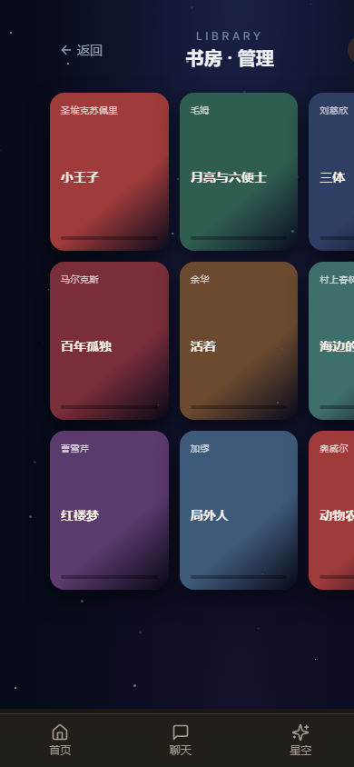
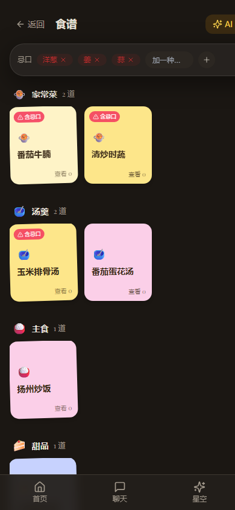

# 小蓝莓 · 项目速览（给 AI 评审用）

> 这是一个「情侣/两人专属」的私密应用。下面先讲清它是什么、用了什么技术、已实现哪些功能，最后附上截图和文件地图，方便你快速上手并给出意见。

## 一、定位

**小蓝莓（Blueberry）** 是一款面向「两个人」的私密陪伴类 Web App：一起听音乐、一起读书、一起记录饮食与纪念日。数据存本机（localStorage / SQLite），无公网账号体系，强调「只属于我们俩」的私密感。

重点做好的一个场景是 **「一起听 · 一起读」**（App 内叫「星空」，路由 `/sky`）——像网易云「一起听」那样，一张黑胶唱片在转，旁边是两个人的书架。

## 二、技术栈

- **前端**：React 18 + TypeScript + Vite 5 + Tailwind CSS v3
- **状态**：Zustand（`persist` 中间件，存 localStorage）
- **路由**：React Router v6
- **音频**：Web Audio API（生成噪声当「电台底噪」）+ HTML5 Audio + `speechSynthesis`（朗读）
- **后端**：Fastify（Node/TS），端口 3001，`/api/chat/stream` 走 SSE 流式输出（对接大模型做 AI 导入/总结）
- **图标**：lucide-react
- **部署**：`deploy/` 目录已备好 Docker（后端 Fastify + SQLite，前端 nginx 托管 SPA + `/api` 反代，SSE 不缓冲）

## 三、已实现功能清单

### 星空主页 `/sky`
- 顶部一块星空背景 + 入口卡片（食谱 / 甜品小屋）。
- 下方「一起听」黑胶唱片：**红色唱盘置底**，白色播放键叠在上方（之前「播放键要点一下才可见」的问题已改掉，现在常显）。
- 可选择「电台底噪」或「广播电台」两种背景音源。

### 一起读 · 书架 `/sky`（内嵌）
- 书架做成**单行可横向滑动**的一排书脊。
- 点「管理」进入独立「书房」页 `/library`：书**一本本平铺**成封面网格，点开进入详情弹窗。

### 书房 · 管理 `/library`
- 书平铺网格；有封面图就显示图，没有就用色块+书名/作者。
- **导入一本书**的编辑器：
  - 封面 = **导入图片**（图片转 dataURL 存 `book.cover`），封面放在**书名/作者左边**。
  - 正文 = **导入文本文件即正文**（`.txt`/`.md`，文件内容进 `book.content`）。
  - 目录 = **AI 自动总结**（点「AI 生成目录」→ 调后端大模型，从正文切 4000 字归纳 3~12 个章节），**用户不用手写**。
- 另有「AI 导入」按钮：贴书名/作者/链接，AI 整理成结构化书籍数据一键入库。

### 书本详情弹窗
- 显示封面、书名、作者、**阅读进度条**、详情、目录。
- 「开始阅读 / 继续阅读」进入阅读器。

### 阅读器 `/read/:id`
- **长按选中文字 → 标画**：荧光笔 / 下划线（字符偏移量方案，不污染 DOM）。
- 每条标画旁可**留言**（对方可见）。
- **实时阅读进度**：滚动即上报进度，页面显示「已实时同步 · TA 可见」。
- 目录抽屉可跳转。

### 食谱 `/cookbook` 与 甜品小屋 `/dessert`
- 菜单式卡片，**按品类分组 + 横向滑动**，点开是「便签」小卡片。
- 每道菜显示：**食材、用量、具体做法（步骤）、忌口标注**，以及「查看次数 / 做过几次」。
- 两个做菜模块**共享一份忌口**（如 洋葱/姜/蒜），命中忌口的菜**标注出来但不隐藏**。
- 都可 **AI 导入**（粘贴描述/链接，AI 归纳出食材+做法+忌口）。
- 都有**返回键**。

### AI 能力（贯穿）
- 书籍 / 菜谱 / 甜品 都能通过 AI 一键导入并结构化。
- 书目录 AI 总结；做菜步骤 AI 归纳。

## 四、关键文件地图

```
前端/
  src/features/sky/          ← 「一起听·一起读」核心
    StarrySkyPage.tsx        星空主页（入口卡片 + 唱片 + 书架）
    VinylPlayer.tsx          黑胶播放器（红盘置底 + 播放键在上）
    Bookshelf.tsx            单行书架
    LibraryPage.tsx          书房/管理（封面图导入 + 文件正文 + AI 目录）
    BookDetailModal.tsx      书本详情弹窗（进度/名称/详情/目录）
    BookReaderPage.tsx       阅读器（标画 + 留言 + 实时进度）
    CookbookPage.tsx         食谱（菜单卡片 + 忌口）
    DessertHousePage.tsx     甜品小屋（菜单卡片 + 忌口）
    bookStore.ts             Zustand 书库（含 cover/content/toc/annotations/progress）
    dietStore.ts             共享忌口 store
    aiImport.ts              AI 导入 + aiSummarizeToc
    AiImportDialog.tsx       通用 AI 导入弹窗
  src/features/chat/         AI 聊天（SSE）
  src/features/diary/        日记本
  src/features/memorial/     纪念日
  src/features/notes/        蓝莓信箱
  src/features/schedule/     日程
  src/app/router.tsx         路由表
后端/
  src/routes/chat.ts         /api/chat/stream（SSE，注入全局 system 提示词）
deploy/                       Docker + nginx 部署脚手架
```

## 五、截图

| 页面 | 截图 |
|---|---|
| 星空主页（黑胶 + 入口卡片 + 书架） |  |
| 书房 · 管理（书本平铺） |  |
| 食谱（菜单卡片） |  |
| 甜品小屋（菜单卡片） |  |
| 一起听（黑胶播放器） |  |

> 截图与本文档同目录（`docs/`）。若把本文档内容粘贴给网页版 AI，请**同时上传这几张截图**，否则图片会丢。

## 六、希望 AI 重点给意见的方向

1. **黑胶播放器**：红盘置底 + 播放键在上的层级，视觉上是否自然？还有没有更好的处理方式。
2. **导入体验**：封面图在左、正文用文件导入、目录 AI 生成——这套「三件套」流程顺不顺，能不能更简化。
3. **阅读器标画**：长按选中 + 荧光笔/下划线 + 留言 + 实时进度的交互，有没有遗漏或别扭的地方。
4. **食谱/甜品菜单**：按品类横向滑动的便签卡片，信息密度和层级是否合适。
5. 整体视觉风格（星空 / 深色 / 便签质感）是否有可提升处。
